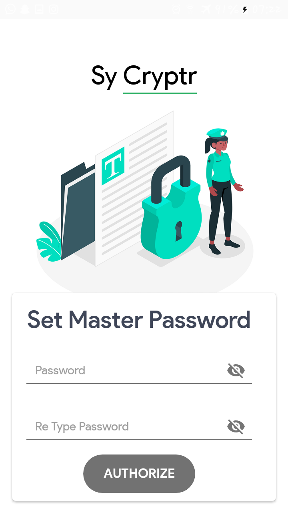
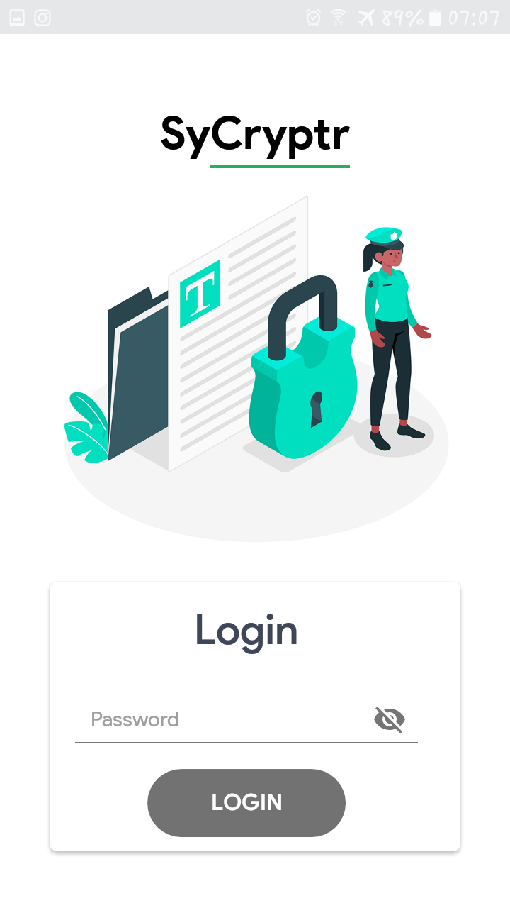
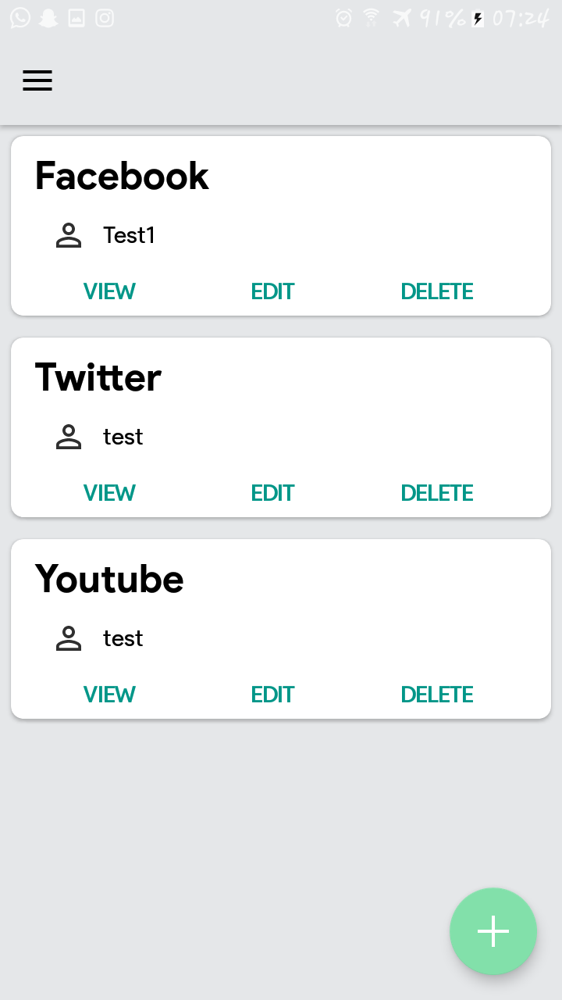
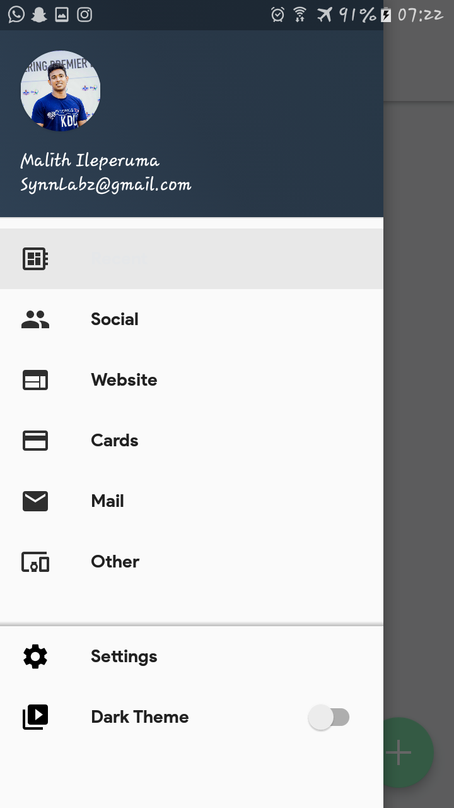
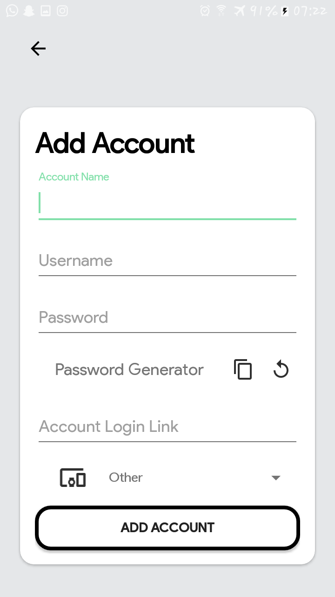
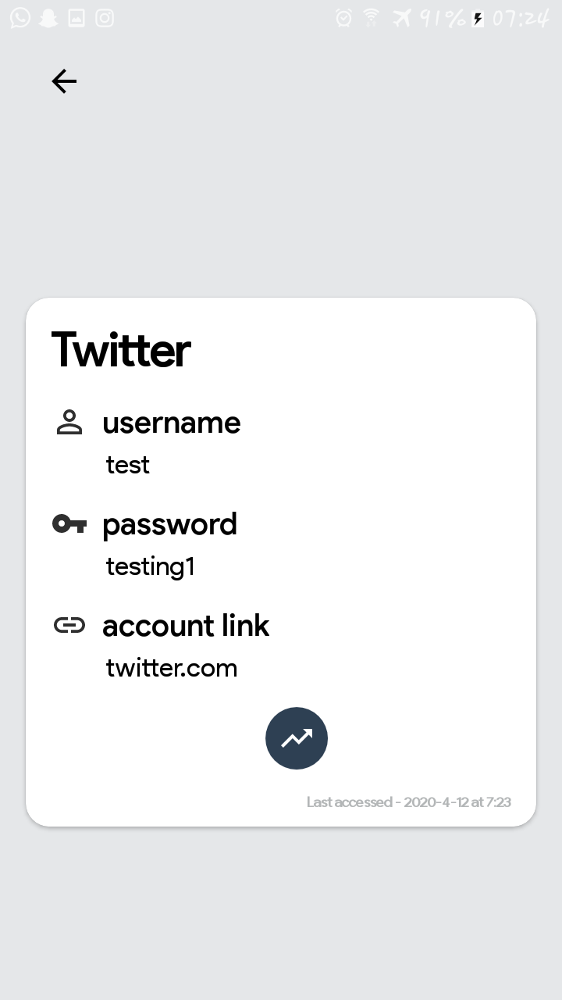

# Sycryptr

An offline password manager

## Features

* Open Source
* All the files are Encrypted
* Not require internet connection
* Password Generator
* backup support
* categorized accounts
* protected with master password
* Screenshots not allowed
* Url support

## Screenshots

|  	  |  	     |  		|  |
| --------------------------------------- | ---------------------------------------- | ---------------------------------------- | ---------------------------------------- |
| Set Master Password                     | Login Window                             | Home		                        | Categories                               |

|  	   	  |  	     | ![Home]Screenshots/Edit.png)  		|  	   |
| ----------------------------------------| ---------------------------------------- | ---------------------------------------- | ---------------------------------------- |
| Add Account                             | View Account                             | Edit Account			        | Authorized with master password          |

## About Sycryptr?

Like other password manager, All your credentials are encrypted.
We do notrequire any internet connection. we dont save your credintials in cloud databases. we save all your credentials in your own mobile device. you can categorize the accounts as your wish and it will be easy to sort.

## License
Sycryptr is licensed under [Apache-2.0 License](https://github.com/Malith97/Sycryptr/master/LICENSE)

