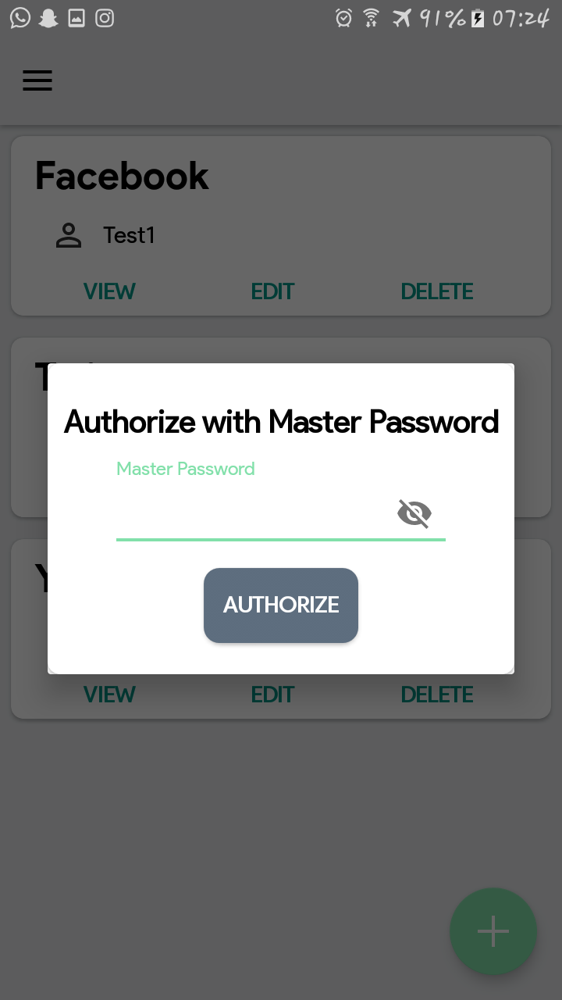

# Sycrypt

Like other password manager, Sycryptr also use a master password for encryption & decryption. All your credentials are encrypted. 
Our most important design guideline is we DO NOT upload your database to anywhere. Not to a cloud or self-hosted server. We DO NOT require internet permission in this app. All your credentials are in your local storage safely. In Emergency case we also have backup facilities

## Features

* Open Source
* All the files are Encrypted
* Not require internet connection
* backup support
* categorized accounts
* protected with master password
* Url support

## Screenshots

|  	  |  	     |  |  |
| --------------------------------------- | ---------------------------------------- | ---------------------------------------- | ---------------------------------------- |
| Set Master Password                     | Login Window                             | Home		                        | Categories                               |

|  	   	   |  	      | ![Home]Screenshots/Edit.png)  		 |  |
| ---------------------------------------- | ---------------------------------------- | ---------------------------------------- | ---------------------------------------- |
| Add Account                              | View Account                             | Edit Account			         | Authorized with master password          |

## About Sycryptr?

Like other password manager. All your credentials are encrypted.
We do notrequire any internet connection. we dont save your credintials in cloud databases. we save all your credentials in your own mobile device. you can categorize the accounts as your wish and it will be easy to sort.

## License
Sycryptr is licensed under [MIT License](https://https://github.com/Malith97/Sycryptr/master/LICENSE)

